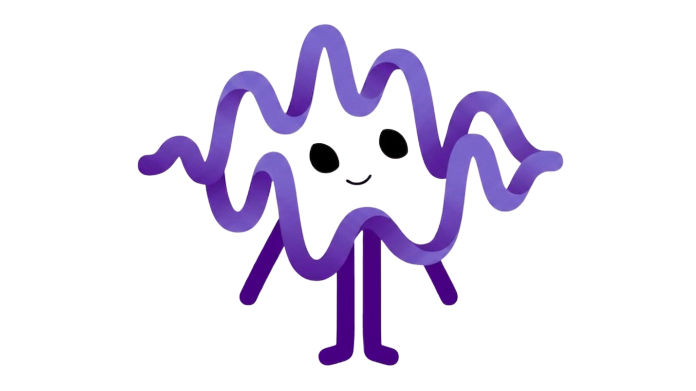
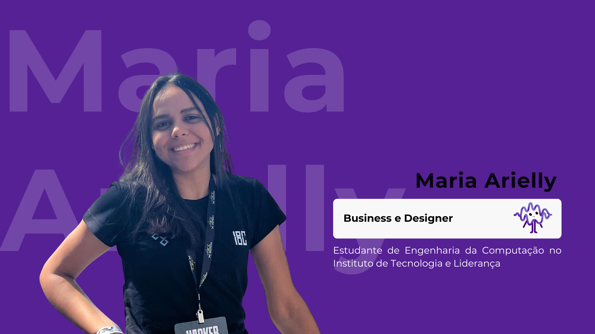
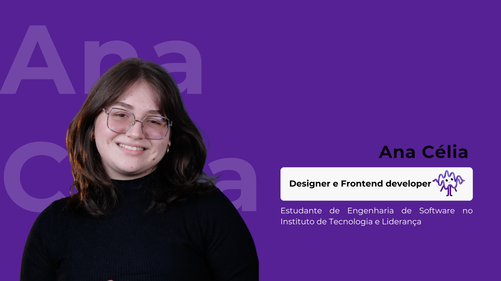
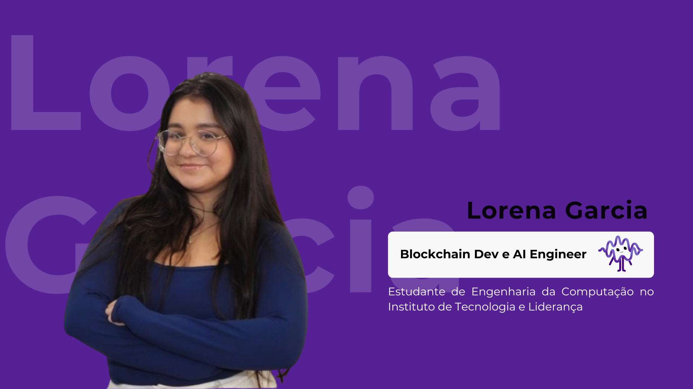

<div align="center">

# Ecoa

</div>

<div align="center">
  
</div>

---

<p align="center"><i>A voz é da criança. O aprendizado é da máquina.</i></p>

## Equipe

<div align="center">
  <table>
    <tr>
      <td align="center">
        <a href="https://www.linkedin.com/in/maria-arielly">
          <br>
          <sub><b>Maria Arielly</b></sub>
        </a><br>
        <sub>Business, Produto e UX</sub>
      </td>
      <td align="center">
        <a href="https://www.linkedin.com/in/ana-c%C3%A9lia-amaral/">
          <br>
          <sub><b>Ana Célia</b></sub>
        </a><br>
        <sub>UX/UI e Frontend</sub>
      </td>
      <td align="center">
        <a href="https://www.linkedin.com/in/llorengarcia/?locale=pt">
          <br>
          <sub><b>Lorena “Loren” Garcia</b></sub>
        </a><br>
        <sub>ASR, Backend e Blockchain</sub>
      </td>
    </tr>
  </table>
</div>

## Descrição

O **Ecoa** é uma plataforma acessível e gamificada que coleta amostras de voz de
crianças com fala não padrão e utiliza esses dados autorizados para fazer o
**fine-tuning de um ASR pré-treinado**.

O objetivo é adaptar a tecnologia à fala da criança para que ela consiga
comunicar pedidos e escolhas aos pais e utilizar jogos, assistentes e
ferramentas educacionais com menos falhas e repetições.

O diferencial técnico é o treinamento descentralizado: a
**Psyche Network** distribui experimentalmente o fine-tuning entre GPUs
autorizadas, enquanto a **Solana** coordena os participantes e as etapas da run.

<p align="center">
  <b><a href="https://ecoa-zeta.vercel.app/">Experimentar o MVP</a></b>
  &nbsp;·&nbsp;
  <b><a href="https://arielly-lima.github.io/YC-Blockchain/">Acessar a documentação completa</a></b>
</p>

> [!NOTE]
> O MVP publicado é uma demonstração frontend. A captura do microfone é real; reconhecimento do ASR, fine-tuning e Psyche/Solana ainda utilizam dados simulados.

## Problema enfrentado

Sistemas de Reconhecimento Automático de Fala são treinados majoritariamente
com falas consideradas padrão. Por isso, uma criança pode ser compreendida pela
família e continuar invisível para o tablet, o jogo ou o assistente virtual.

No Brasil:

- o Censo 2022 identificou **14,4 milhões de pessoas com deficiência**;
- aproximadamente **2,7 milhões** estavam em uma categoria que inclui
  dificuldade permanente para comunicar-se;
- **2,4 milhões de pessoas** foram identificadas como diagnosticadas com
  autismo;
- entre crianças de 5 a 9 anos, a proporção de diagnóstico de autismo chegou a
  **2,6%**.

Esses números não estimam diretamente a população com fala não padrão. Eles
dimensionam grupos que podem enfrentar barreiras de comunicação e
acessibilidade.

A lacuna central está entre **usar a própria voz** e **ser compreendido pela
tecnologia**.

## CAA e ASR

A **Comunicação Aumentativa e Alternativa (CAA)** reúne estratégias que ampliam
ou complementam a fala, como gestos, símbolos, imagens, botões e aplicativos.

O **ASR** transforma áudio em texto, intenção ou comando. Ele não substitui a
CAA; funciona como uma camada complementar para tornar ferramentas baseadas em
voz mais acessíveis.

## Ecossistema Ecoa

| Conceito | Descrição | Finalidade |
|:---|:---|:---|
| **Aventuras de voz** | Missões curtas, visuais e não punitivas | Coletar fala contextualizada com maior engajamento |
| **Confirmação familiar** | O responsável confirma a intenção e autoriza a amostra | Produzir rótulos úteis e manter controle dos dados |
| **Dataset pessoal** | Amostras autorizadas e versionadas por criança | Preparar dados para personalização |
| **Fine-tuning do ASR** | Ajuste de um modelo pré-treinado | Adaptar o reconhecimento à fala da criança |
| **Psyche Network** | Treinamento experimental entre GPUs autorizadas | Descentralizar a capacidade de fine-tuning |
| **Solana** | Coordenação on-chain da run | Manter estado, participantes e etapas verificáveis |
| **Dados off-chain** | Áudios, transcrições, identidades e modelos criptografados | Proteger dados pessoais e sensíveis |
| **Comunicação conectada** | Saída de intenção, texto ou comando | Integrar família, jogos e ferramentas digitais |

## Principais funcionalidades

### 1. Experiência infantil

- login com PIN;
- interface mobile-first;
- mascote Lumi acompanhando as missões;
- pistas por voz e escolhas por imagens;
- gravação e reprodução do áudio;
- feedback imediato;
- novas tentativas sem punição;
- estrelas, progresso e conquistas sem rankings.

### 2. Área do responsável

- controle de consentimentos;
- reprodução das gravações;
- confirmação da intenção;
- autorização ou descarte de amostras;
- identificação da versão do dataset;
- comparação entre ASR-base e modelo adaptado.

### 3. Personalização do ASR

- seleção de um modelo pré-treinado em português;
- criação de dataset pessoal progressivo;
- separação entre treino, validação e teste;
- fine-tuning individual;
- avaliação com WER, CER e acerto de intenção;
- validação em frases não utilizadas no treinamento.

### 4. Treinamento descentralizado

- runs permissionadas;
- GPUs e carteiras autorizadas;
- Coordinator e Authorizer na Solana;
- adaptação experimental da Psyche para áudio;
- vínculo entre dataset, execução e modelo;
- dados infantis mantidos fora da blockchain.

### 5. Integração tecnológica

- API planejada para áudio autorizado;
- retorno de intenção, texto ou comando;
- integração com tecnologias assistivas;
- integração com jogos e ferramentas educacionais;
- controle de perfis, versões e consumo.

## Tecnologias

| Camada | Tecnologia | Estado |
|:---|:---|:---|
| **Frontend** | React 19 e Vite 7 | Protótipo navegável |
| **Captura de voz** | MediaRecorder | Funcional no navegador |
| **ASR** | Modelo pré-treinado a selecionar | Candidato |
| **Fine-tuning** | Pipeline de adaptação pessoal | A implementar |
| **Treinamento distribuído** | Psyche Network | Experimental |
| **Coordenação on-chain** | Solana | Simulada no protótipo |
| **Dados privados** | Armazenamento criptografado off-chain | Arquitetura definida |
| **Documentação** | Docusaurus 3 | Funcional |

## Arquitetura resumida

```text
Aplicativo infantil ─────┐
                        ├── API e motor de atividades
Área do responsável ────┘             │
                                      ├── dados criptografados off-chain
                                      ├── pipeline e modelos ASR
                                      └── Psyche + Solana
                                               │
                                               └── ASR adaptado
                                                      │
                                                      ├── família
                                                      └── ferramentas digitais
```

O Ecoa não pretende treinar um modelo-base do zero. O fluxo parte de um ASR
existente e mede se o fine-tuning melhora a compreensão da voz da criança.

## Por que blockchain?

Blockchain não é utilizada como um banco de áudios. Seu papel central é
coordenar a capacidade de treinamento descentralizado.

> **Não descentralizamos a voz das crianças. Descentralizamos a capacidade de
> construir uma inteligência artificial que as compreenda.**

Rastreabilidade, segurança, privacidade e auditabilidade são benefícios
decorrentes. Áudios e identidades permanecem criptografados fora da blockchain.

## Modelo de sustentabilidade

O Ecoa vende **software, integração, computação e suporte**. Nunca vende a voz
infantil.

| Oferta | Comprador | Cobrança |
|:---|:---|:---|
| **Piloto técnico** | Empresas, universidades e redes públicas | Projeto com escopo e prazo fechados |
| **Plataforma e API** | Tecnologias assistivas, jogos e ferramentas educacionais | Integração, assinatura e consumo |
| **Fine-tuning gerenciado** | Organizações com dados e autorizações válidas | Ciclo de treinamento, GPU e armazenamento |
| **Acesso patrocinado** | Fundações, empresas e redes públicas | Quantidade de acessos por período |

Nos primeiros 12 meses, o piloto técnico pago é a principal porta de entrada.
A receita recorrente começa depois da validação de desempenho, custo e
estabilidade.

## Benchmarking

O projeto foi comparado com:

- **ASR para fala não padrão:** Voiceitt e Project Relate;
- **reconstrução de voz:** Whispp;
- **CAA nacional:** Livox e Matraquinha;
- **CAA internacional:** TD Snap e Proloquo;
- **dados e pesquisa:** Project Euphonia e Speech Accessibility Project;
- **infraestrutura distribuída:** Psyche, Flower e Gensyn.

O diferencial planejado do Ecoa está na combinação entre jornada infantil,
confirmação familiar, ASR pessoal, integração tecnológica e treinamento
descentralizado permissionado.

Consulte o
[benchmarking completo](docs/docs/solucao/banchmarking.md).

## Status

**Protótipo navegável em evolução para um MVP técnico.**

| Componente | Estado |
|:---|:---|
| Captura e reprodução do microfone | Real |
| Experiência infantil | Navegável |
| Consentimentos e confirmação | Interativos no protótipo |
| Reconhecimento do ASR | Simulado |
| Dataset versionado | A implementar |
| Fine-tuning pessoal | A implementar |
| Psyche/Solana para áudio | Experimental e simulado |
| API externa | Planejada |

O frontend ainda contém telas legadas do antigo fluxo profissional. Elas não
representam as personas atuais e serão removidas ou refatoradas antes da
versão alpha.

Consulte o [status detalhado](docs/docs/status_projeto.md) e o
[roadmap de 12 meses](docs/docs/roadmap.md).

## Roadmap resumido

| Período | Entrega |
|:---|:---|
| **Meses 1–3** | Requisitos, dados seguros e coleta funcional |
| **Meses 4–6** | Fine-tuning mensurável e run permissionada |
| **Meses 7–9** | Alpha integrada e piloto controlado |
| **Meses 10–12** | Productização, beta e publicação |

## Executar o frontend

Requisito: Node.js 20 ou superior.

```bash
cd frontend
npm install
npm run dev
```

O Vite exibirá o endereço local no terminal.

Credenciais principais da demonstração:

- criança: **Lia**, PIN `1234`;
- responsável: `renata@demo.ecoa`, senha `demo123`.

Build de produção:

```bash
cd frontend
npm run build
npm run preview
```

## Executar a documentação

```bash
cd docs
npm install
npm run start
```

A documentação ficará disponível em
`http://localhost:3000/YC-Blockchain/`.

Build de produção:

```bash
cd docs
npm run build
npm run serve
```

## Estrutura do repositório

```text
YC-Blockchain/
├── frontend/          # Protótipo React/Vite
├── docs/              # Documentação Docusaurus
├── contexto_ideia.md  # Contexto consolidado
└── README.md          # Visão geral e instruções
```

## Links

- [Demonstração do MVP](https://ecoa-zeta.vercel.app/)
- [Documentação](https://arielly-lima.github.io/YC-Blockchain/)
- [Repositório](https://github.com/arielly-lima/YC-Blockchain)
- [Visão geral](docs/docs/visao_geral.md)
- [Proposta de valor](docs/docs/solucao/proposta_valor.md)
- [Arquitetura](docs/docs/solucao/arquitetura.md)
- [Por que blockchain?](docs/docs/stack_tecnologias/porque_blockchain.md)
- [Modelo financeiro](docs/docs/solucao/modelo_financeiro.md)
- [Equipe](docs/docs/equipe.md)

---

<p align="center">
  Desenvolvido para o <b>Youth Challenge Blockchain 2026</b>.
</p>
